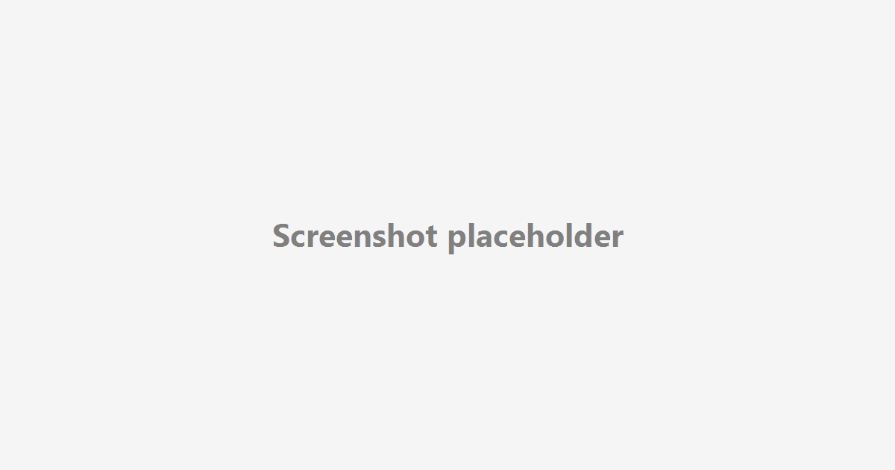

# Micro RPG: Knight vs Goblins

A small pygame RPG prototype built for a short development challenge.

## Screenshot


Replace `docs/screenshot.png` with a real screenshot or GIF.

## Controls
- Move: WASD or Arrow Keys
- Attack: Space
- Heal: H (or E)
- Restart after win/lose: R
- Title / exit screen: Esc

## Quickstart
### Prerequisites
- Python 3.11+
- pygame

### Run locally
```bash
python -m pip install pygame
python main.py
```

## Tests
```bash
python -m unittest discover -s tests
```
